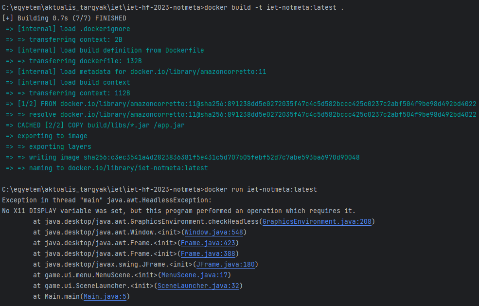

A házi feladat elkezdésekor úgy gondoltuk, hogy projekttől függetlenül céleszerű
docker konténerbe rakni az alkalmazásunkat. Jelen esetben arra a véleményre jutottunk, 
hogy nem ez a helyzet. A konténerizációt a következőképpen akartuk végrehajtani:

- A Gradle build tool segítségével futtatható jar-t készítünk (megvalósítva)
- Dockerfile segítségével futtatható image-et hozunk létre (megvalósítva)
- Futtatjuk a konténert (meghiúsult): ugyanis a projekt egy grafikus felülettel
rendelkező alkalmazás, amelyhez az alább csatolt hiba megoldásának keresése során arra
jutottam, hogy a futtató gépen kell futtatni egy ún. X server-t, ami biztosítja a grafikus
felületet és a kattintások továbbítását a konténer felé. Ezzel több probléma is van:
először is nem sikerült ennek a működésbe hozatala, másrészt ha sikerült is volna, akkor
is a docker létjogosultságát veszti, mert nem csak a konténerben lévő szoftverek kellenek
az alkalmazás futtatásához. X11 Display-t mindig kell állítani az olyan komponensekhez, amelyek
a projektben voltak használva (Canvas, Frame stb.)

Mindezek alapján a konténerizációt ehhez a projekthez elvetettük.